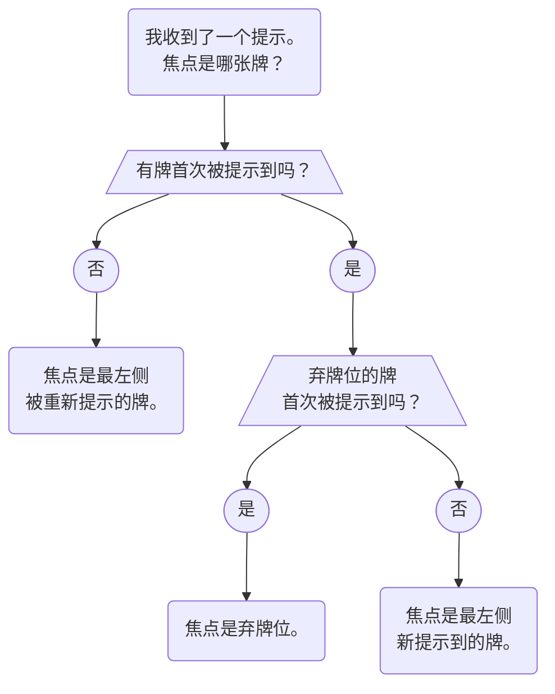

- 即使你没有玩过花火，你也可以学习等级 1 的内容。你可以在玩第一局之前学习，也可以在玩了几局熟悉基本规则后再来学习。
- 这里的内容大部分是对[入门指南](beginner.mdx)的重复，但会更加详尽一些。
- 如果你还没读过入门指南，<Em>**请立即停止**</Em>，先去阅读入门指南。我们建议你玩了 5-10 局游戏后，再回到这里。（本页仅作为已阅读入门指南的玩家的参考。）
- 译注：这个地方有点矛盾，但等级 1 和入门指南几乎是一样的，译者建议先玩几局熟悉基本规则后，再看入门指南和等级 1 的内容，这样方便理解一些约定背后的道理。

## 约定 \{#conventions\}

### 弃牌位（Chop） \{#chop\}

- 当玩家需要弃牌时，通常会弃掉最右侧未提示过的牌。
- 玩家的弃牌位（Chop）正式定义为：**当这个玩家无事可做时，他接下来会弃掉的未提示过的牌的位置**。
- 如果玩家有一张已知无用的提示过的牌，通常会**先弃掉无用牌**，然后再弃掉弃牌位的牌。（但无用牌<Em>**不算**</Em>弃牌位——弃牌位仍然是最右侧未提示过的牌。）

### 可打出（Playable）的定义 \{#the-definition-of-playable\}

- 首先，请参阅入门指南中关于[_延迟出牌提示_](beginner/delayed-play-clues.mdx)的章节。
- 当我们说一张未提示过的牌目前*可打出（Playable）*时，我们<Em>**并不**</Em>表示这张牌可以立即打出去。如果一张未提示过的牌*可打出*，实际上是指可以由某人对这张牌给出*出牌提示*{}**或者**_延迟出牌提示_。
- 换句话说，如果一张未提示过的*可打出*的牌收到了*延迟出牌提示*，那么这张牌最终能够在不需要其他人额外提示的情况下被打出——在这个*出牌提示*给出时，所有中间需要的牌（若有）都已出现且处理过。

### 留牌提示 \{#save-clues\}

- 你<Em>**只能**</Em>对弃牌位的牌给予*留牌提示*。
  - 这意味着，如果一个提示的焦点牌不在弃牌位，那么它一定是一个*出牌提示*！
- 你<Em>**不能**</Em>随意对任何牌给予*留牌提示*。你<Em>**只能**</Em>对以下特定牌给予*留牌提示*：
  1. 5（通过数字 5 提示，作为*留 5 提示*）
  1. 2（通过数字 2 提示，作为*留 2 提示*）
  1. 关键牌（通过颜色或数字提示）
- 此外，我们都同意，绝不允许任何人弃掉目前场面上唯一的可打出牌。不过，对这种牌的提示算作*出牌提示*，而不是*留牌提示*。

### 提示的焦点 \{#clue-focus\}

确定提示的焦点有 4 个步骤：

1. 如果没有新牌，则**焦点是最左侧被重新提示到的牌**。
1. 如果只有一张新牌，则**焦点是新牌**。
1. 如果有两张以上新牌，且其中一张在弃牌位，则**焦点是弃牌位的牌**。
1. 如果有两张以上新牌，且没有牌在弃牌位，则**焦点是最左侧的新牌**。

这个过程可以用以下流程图表示：

### 游戏早期 \{#the-early-game\}

- 游戏*早期*是指任何玩家从弃牌位弃牌之前的时间段。
- 玩家<Em>**必须**</Em>在结束游戏*早期*之前穷尽所有可行的*出牌提示*和*留牌提示*。
  - 如[入门指南](beginner/minimum-clue-value-principle.mdx)所述，穷尽所有*出牌提示*并<Em>**不包括**</Em>给出*节奏提示*。*节奏提示*不符合*提示价值下限原则*，因此通常不应给出。
- 对于等级 9 的玩家，关于游戏早期有一些[额外规则](level-9.mdx#the-early-game-severity-1-stalling)。（如果你是等级 1 玩家，暂时不必担心这些。）

## 特殊行动 \{#special-moves\}

### 留 5 提示 \{#the-5-save\}

- *留 5 提示*是指用数字 5 来提示某人弃牌位上的一张未提示过的 5。（大家都同意这只是*留牌提示*，而不是*出牌提示*。）
- 根据约定，你只能通过数字提示来执行*留 5 提示*。（如果使用颜色来提示一张未提示过的 5，那么它是*出牌提示*。）

### 留 2 提示 \{#the-2-save\}

- *留 2 提示*是指某人使用数字 2 提示某人弃牌位上的一张未提示过的 2。（大家都同意这只是*留牌提示*，而不是*出牌提示*。）
- 根据约定，你只能通过数字提示来执行*留 2 提示*。（如果使用颜色来提示一张未提示过的 2，那么它将是*出牌提示*。）
  - 例外情况是，如果另一张 2 已经在弃牌堆中。那么，使用颜色提示来提示这张牌将是*留关键牌提示*。但这不会被归类为*留 2 提示*。

#### 可见规则 \{#the-visible-rule\}

- 如果你能在其他玩家手中看到另一张 2，你<Em>**不允许**</Em>对 2 执行*留 2 提示*。

#### 双弃牌位 2 \{#double-chop-2s\}

- *可见规则*有一个例外情况，即当同一张 2 同时出现在两名玩家的弃牌位上时。这种情况下，玩家可以用*留 2 提示*提示其中任意一张。如果是游戏*早期*，玩家<Em>**必须**</Em>先保存其中一张，再考虑作出 *5 停顿*或者通过弃牌进入*中期*。

### 引牌（Prompt） \{#the-prompt\}

- <strong>引牌（Prompt）</strong>是指你让一名玩家打出一张之前未知的提示过的牌。
- 如果玩家**本来就要打出**这张牌，那么<Em>**这不是*引牌***</Em>。*引牌*只能针对那些本来不会打出的牌。
- 如果玩家被*引牌*，且手中有多张牌可能适用此*引牌*，那么应该打出最左侧的牌。
- 关于*引牌*的示例可以在[入门指南](beginner/prompt.mdx)中找到。
- 对于等级 5 的玩家，请参阅[_彩色变体中的引牌_](level-5.mdx#prompts-in-multi-color-variants)的章节。

### 飞牌（Finesse） \{#the-finesse\}

- {/* prettier-ignore */}
  <strong>飞牌（Finesse）</strong>是指你让一名玩家盲打一张牌，以兑现某张牌当前可打出的承诺。
- *飞牌*在[入门指南](beginner/finesse.mdx)中有详细说明。
- *飞牌*必须针对“相连”的牌。（例如，红 1 直接引向红 2，因此它们被视为“相连”的牌。）
- 当一名玩家被*飞*时，应该立即盲打自己的牌以证明这一点！

### 飞牌位 \{#finesse-position\}

- 玩家的*飞牌位*指的是**最左侧未提示过的牌**所在的位置。
- 对于等级 5 的玩家，请参阅[_依序飞牌_](level-5.mdx#the-queued-finesse)的章节。
  - 使用*依序飞牌*会使*飞牌位*的概念更加复杂，因为在某些情况下，未提示过的牌会被视为已提示过
    - 译注：这里的未提示指没有被提示直接触及，已提示指在飞牌时，这张牌已经被给出了明确的信息。

### 被飞的牌 \{#finessed-cards\}

- 尽管被*飞*的牌未被提示，但你可以认为它们上面有一个隐形的提示。（因为已经“获取”它们。）
- 因此，如果一个提示同时提示了一张被*飞*的牌和另一张未提示过的牌，那么提示的焦点将在另一张牌上（因为提示的焦点总是在“新”牌上）。

### 引牌 > 飞牌 \{#prompts--finesses\}

- ***引牌*总是优先于*飞牌***。
- 这意味着，如果 Alice 必须在以下两者之间做出选择：
  1. 打出手中有红色提示的牌
  1. 盲打*飞牌位*上可能的红牌
- 那么 Alice 应当选择 ⑴。

## 网站功能 \{#website-features\}

- 如果你在 [Hanab Live](https://hanab.live) 上玩过几局游戏，你可能会注意到网站有几个功能。
- 网站有[详细的文档](https://github.com/Hanabi-Live/hanabi-live/blob/master/docs/features.md#notes)。（你也可以通过点击网站大厅右上角的“帮助”图标进入该页面。）
- 以下是初学者应该了解的几个最重要的功能。

### 笔记 \{#card-notes\}

- 你应该在每局游戏中[写笔记](beginner/card-notes.mdx)。（不应视笔记为一种负担。世界上最优秀的玩家也在不断写笔记 ;）
- 某些特殊笔记会[改变牌的外观](https://github.com/Hanabi-Live/hanabi-live/blob/master/docs/features.md#notes)。
  - 如果你写下 `red 2` 或 `r2` 这样的牌名，牌的图像会立即显示为所写的牌（红 2）。
  - 笔记 `f` 用于表示一张牌被*飞*（意味着它将在未来盲打）。网站会在被*飞*的牌周围绘制特殊边框。
    - 你可以使用 `shift + 右键点击` 作为快捷方式添加此笔记。
  - 笔记 `cm` 用于表示一张牌已被弃牌位*移*过。网站会在弃牌位*移*过的牌周围绘制特殊边框。（*弃牌位移动*是等级 4 引入的特殊约定。如果你是等级 1 玩家，暂时不必担心。）
    - 你可以使用 `alt + 右键点击` 作为快捷方式添加此笔记。
  - 你还可以使用中括号来堆叠多个笔记。例如，`[f] [red 2]`。
- 译注：[这里](card-notes.mdx)是 Hanab Live 网站文档对此功能介绍的翻译。

### 回放 \{#rewind\}

- 在游戏中，点击左下角的箭头按钮可以打开[游戏内回放功能](https://github.com/Hanabi-Live/hanabi-live/blob/master/docs/features.md#in-game-replay)。
  - 你也可以使用方向键作为快捷方式来回退或前进时间。
- 这在需要回忆几回合前发生的事情时非常有用。

### 共情 \{#empathy\}

- 如果你按下空格键或左键点击其他玩家的手牌，你可以看到对方眼中的牌是什么样子。
- 这相当于在现实生活中问“你知道你手上有哪些牌吗？”
- 此功能被称为“共情”。

## 挑战问题 \{#challenge-questions\}

等级 1 的挑战问题列在[入门指南](beginner.mdx)中。
