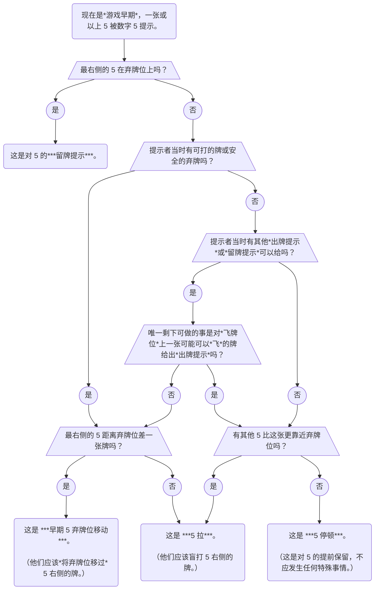

import TheFivePull from "./level-19/the-five-pull.yml";
import TheFivePullPrompt from "./level-19/the-five-pull-prompt.yml";
import TheFivePullDoubleFinesse from "./level-19/the-five-pull-double-finesse.yml";
import TheFivePullClandestineFinesse from "./level-19/the-five-pull-clandestine-finesse.yml";
import TheFivePullPromise from "./level-19/the-five-pull-promise.yml";
import TheFiveNumberEjection from "./level-19/the-five-number-ejection.yml";
import TheFiveNumberDischarge from "./level-19/the-five-number-discharge.yml";
import InteractionsBetween2SavesAnd5Stalls from "./level-19/interaction-between-2-saves-and-5-stalls.yml";

## 约定 \{#conventions\}

### 低分数阶段与正常分数阶段 \{#the-low-score-phase-and-the-normal-score-phase\}

- 现在，你应该已经知道我们将每局花火游戏分出*早期*和*中期*（基于何时有人弃牌）。
- 类似地，我们也将每局花火游戏分出*低分数阶段*和*正常分数阶段*：
  - *低分数阶段*定义为分数低于 `2 × 花色数量` 的阶段。（例如，在无变体游戏中为 10 分，在 3 花色游戏中为 6 分等等。）
  - *正常分数阶段*定义为分数达到或超过此阈值的阶段。
- 一些使用数字 5 提示的特殊行动只能在游戏的*低分数阶段*执行。
- 在 Hanab Live 上，在*低分数阶段*时，分数会显示为青色。

### 低分数阶段禁止用数字 5 作出出牌提示 \{#no-play-clues-with-a-number-5-clue-in-the-low-score-phase}

- 正常情况下，如果玩家用数字 5 来提示一张距离弃牌位差两张牌以上的 5，且该玩家不处于停顿局面，那么这会是对 5 的*出牌提示*。
- 然而，在*低分数阶段*，**任何**数字 5 提示都**不应**解读为直接的*出牌提示*。
- 相反，它们应解读为更高级的行动。（参见下面 [_5 拉_](#the-5-pull)的章节。）
- 这意味着如果需要给可打出的 5 作*出牌提示*，而分数低于平均每花色 2 分，那么此时**必须**使用颜色提示，或者等到之后。

## 特殊行动 \{#special-moves\}

### 早期 5 弃牌位移动 \{#the-early-5s-chop-move}

- 首先，请参阅 [_5 停顿_](level-9.mdx#the-5-stall-intermediate-section)的章节。
- 在*游戏早期*，只有在没有其他事可做时，玩家才允许执行 _5 停顿_。（或者作为特殊例外，如果只有一个可给的*出牌提示*，而其目标牌在*飞牌位*。）
- 因此，如果有人提示了 5，而**有**其他事情可做，那么他们一定是在尝试传达额外的信息。
- 如果这张 5 距离弃牌位差一张牌，那么他们想要做的是*早期 5 弃牌位移动*。这和普通的 *5 弃牌位移动*工作方式完全相同（只不过它是在*游戏早期*完成的，通常是不可能的）。
- 对于等级 21 的玩家，有一些与*早期 5 弃牌位移动*相关的[附加规则](level-21.mdx#interaction-between-the-chop-move-ignition-and-5-rank-clues)。

### 5 拉 \{#the-5-pull}

- 此约定仅适用于*低分数阶段*。
- 仅在特定情况下，玩家允许执行 _5 停顿_。如果有玩家在不合规的情况下执行了 _5 停顿_，那么执行的根本就不是 _5 停顿_，而会是：
  - _5 弃牌位移动_，若该 5 距离弃牌位差一张牌
  - _出牌提示_，若该 5 距离弃牌位差两张牌以上
- 然而，由于用数字 5 作出的*出牌提示*在*低分数阶段*“关闭”，所以给出提示的玩家想要执行的一定是另外的行动：_5 拉_。
- *5 拉*令收到提示的玩家盲打 5 右侧的牌。提示到的 5 实际上与盲打无关。这就是为什么它被称为*拉*而不是*飞牌*或*诈飞*。
- *5 拉*常在 1 号位的 5 上执行。但是比如说，你也可以提示 2 号位的 5 以便使 3 号位盲打。
- *5 拉*优先于*飞牌*和*诈飞*，因为数字 5 提示不允许认作*出牌提示*。
- 例如在 3 人游戏中：
  - 现在是*游戏早期*以及*低分数阶段*。
  - 红 3 已经打出。
  - Alice 提示 Cathy 数字 5，提升到 1 号位的红 5。（Alice 还有其他*出牌提示*可给，所以这不可能是 _5 停顿_。）
  - 正常情况下，Bob 会认为这是在*飞牌*，他应该盲打*飞牌位*作为红 4。
  - 然而，Bob 知道用数字 5 作出的*出牌提示*在*低分数阶段*“关闭”，这意味着 Alice **并没有**表示红 5 可打出。
  - Bob 可以看到 5 右侧是一张可打出的蓝 1，所以 Alice 一定是想要 _5 拉_。轮到 Cathy 的回合时，Cathy 将盲打那张牌。

<TheFivePull />

- 由于 *5 拉*不是对提示到的 5 的*出牌提示*，所以可以 *5 拉*一张 4，而不保证 5 是同一花色。
- 可能令人困惑的是，*5 拉*与*飞牌*不同。即使同样涉及盲打，*5 拉*也应被视为*延迟出牌提示*（或潜在的*引牌*）。这意味着要盲打的牌有可能需要在现有提示过的牌之后才能打出。
- 当玩家被*飞*或*诈飞*时，可以推迟盲打以执行自己的*飞牌*或*诈飞*。然而，如果玩家可能被*诈飞*，则**禁止**发起 _5 拉_。（玩家仍然允许推迟为*飞牌*盲打以发起 _5 拉_。）
- 在 3 人游戏中通过提示 1 号位和 3 号位的两张 5 来 *5 拉*的罕见情况中，被 *5 拉*的牌是 2 号位。
- 记住，如果唯一被忽略的牌是一张弃牌位上的 2，那么数字 5 提示[总是 *5 停顿*而不是 _5 拉_](#interaction-between-2-saves--5-stalls)。

### 5 拉引牌与 5 拉飞牌 \{#the-5-pull-prompt--the-5-pull-finesse}

- *5 拉*也被可以发起*引牌*或*飞牌*。
- 例如在 4 人游戏中：
  - 现在是第一回合，还没有打出过任何牌。
  - Cathy 的手牌如下，从新到老：`蓝 4、蓝 5、红 2、红 2`
  - Donald 的手牌如下，从新到老：`黄 4、绿 1、黄 3、黄 3`
  - Alice 提示 Cathy 数字 5，提示到 2 号位的蓝 5。
  - Bob 知道现在是*游戏早期*，Alice 的提示可能是 _5 停顿_。
  - 然而，Bob 也知道只有在没有普通的*留牌提示*或*出牌提示*可给时才允许执行 _5 停顿_。Bob 看到 Donald 有一张绿 1 可以给出*出牌提示*。于是，Bob 知道 Alice 的提示不可能是 _5 停顿_，从而形成 _5 拉_（因为距离弃牌位差两张牌以上）。
  - Bob 知道如果这是 _5 拉_，它会拉出红 2。如果 Bob 什么都不做，Cathy 可能会将红 2 当作某张可打出的 1 误打。
  - 因此，这一定是 _5 拉飞牌_，所以 Bob 盲打*飞牌位*。结果是一张红 1，成功打出。
  - Cathy 知道 Bob 会盲打一张牌的唯一原因是这是一次 _5 拉飞牌_。Cathy 盲打她的 3 号位牌。结果是一张红 2，并且成功打出。

<TheFivePullPrompt />

- 与其他类型的*飞牌*不同，在 *5 拉*给出和被 *5 拉*的玩家的下一回合之间，_5 拉飞牌_**必须**至少展现一次盲打（例如是*正向飞牌*）。
- 因此，_5 拉_**不允许**引起*反向飞牌*。（这是因为我们不希望被拉的玩家需要考虑过多的可能性。）
- 记住，在 *5 拉飞牌*中，被拉的牌**必须**与盲打相连。换句话说，不可能执行 _5 拉诈飞_。

### 5 拉双重飞牌 \{#the-5-pull-double-finesse}

- 首先，请参阅 [_5 拉飞牌_](#the-5-pull-prompt--the-5-pull-finesse)的章节。
- 如你所料，也可以以与 *5 拉飞牌*完全相同的方式执行 _5 拉双重飞牌_。
- “被拉”的牌必须与最后的盲打相连。
- 例如在 4 人游戏中：
  - 现在是第一回合，还没有打出过任何牌。
  - Donald 的手牌如下，从新到老：`蓝 4、蓝 5、红 3、黄 1`
  - Alice 提示 Donald 数字 5，提示到 2 号位的蓝 5。
  - Bob 盲打红 1（因为他知道这不可能是 _5 停顿_）。
  - Cathy 盲打红 2（因为她知道需要响应*双重飞牌*）。
  - Donald 知道 *5 拉*出的牌是红 3（与红 1 和红 2 相连）。

<TheFivePullDoubleFinesse />

- 之前我们说过，_5 拉飞牌_**必须**是*正向飞牌*。然而，被 *5 拉*的玩家也**必须**考虑到 *5 拉飞牌*可能是 _5 拉双重飞牌_，其中第二次盲打是*反向飞牌*。（具体来说，我们称此为带有*反向*成分的*飞牌*。）
- 更多 *5 拉双重飞牌*的例子可以在[这里](examples/5-pull-double-finesse.mdx)找到。

### 5 拉暗飞牌 \{#the-5-pull-clandestine-finesse}

- 首先，请参阅 [_5 拉飞牌_](#the-5-pull-prompt--the-5-pull-finesse)的章节。
- _5 拉飞牌_**必须**是*正向飞牌*。
- 然而，被 *5 拉*的玩家**必须**考虑到该*飞牌*可能是*暗飞牌*。
- 例如在 3 人游戏中：
  - 现在是第一回合，还没有打出过任何牌。
  - Bob 的手牌如下，从新到老：`红 1、绿 1、绿 4、绿 4、绿 5`
  - Cathy 的手牌如下，从新到老：`蓝 4、蓝 1、蓝 5、绿 2、蓝 2`
  - Alice 提示 Cathy 数字 5，提示到 3 号位的蓝 5。
  - Bob 盲打红 1（因为他知道不可能是 _5 停顿_）。
  - 通常，Cathy 会认为 Alice 执行了 _5 拉飞牌_，她会盲打 4 号位牌作为红 2（与红 1 相连）。
  - 然而，Cathy 也看到在提示发起时，Bob 在红 1 后还有一张可打出的绿 1。所以，Alice 可能在执行 _5 拉暗飞牌_。
  - Cathy 执行了不相关的行动。
  - Alice 执行了不相关的行动。
  - Bob 从 2 号位盲打绿 1。
  - Cathy 现在知道这确实是 _5 拉暗飞牌_，而她的 4 号位上是绿 2。

<TheFivePullClandestineFinesse />

### 5 拉的保证（5 拉之后的出牌提示） \{#the-5-pull-promise-a-play-clue-after-a-5-pull}

- 通常，*5 拉*必须视为*延迟出牌提示*。这意味着有时拉出的牌可能要很长时间后才能盲打。
- 从被 *5 拉*的玩家的视角来看，如果后续的*出牌提示*指向了一张当前不可打出的牌，那么他们可以忽略*延迟出牌提示*的解释——被 *5 拉*的玩家被**保证**拉出的牌能使那张不可打出牌变为可打出。
- 例如在 4 人游戏中：
  - Alice 手中有两张被提示过的 1——红 1 和蓝 1。
  - Bob 对 Donald 执行 _5 拉_。Donald 知道 *5 拉*出的牌可能是红 2 或蓝 2（如果是*延迟出牌提示*）。
  - Cathy 提示 Alice 一张红 3。现在，Donald 知道他被**保证**红 2 是他被 *5 拉*出的牌（所以他不再需要等待蓝 1 打出后再盲打）。

<TheFivePullPromise />

### 被 5 拉时发起的飞牌是确定性飞牌 \{#finesses-while-5-pulled-are-certain-finesses}

- 有时，被 *5 拉*的玩家可能不会立即打被拉出的牌。他们有可能必须等现有的牌先打出，也有可能他们想在某个*飞牌*还存在时从中获利。
- 被 *5 拉*的玩家执行的任何*飞牌*都应视为*确定性飞牌*。
- 为响应被 *5 拉*的玩家发起的*飞牌*而进行的任何*确定性弃牌*都指向被 *5 拉*出的牌。

### 5 拉跳过 \{#the-5-pull-skip}

- 如果一名玩家已经被*飞*，可以再次*飞*他们，让他们打*第二飞牌位*。
- 类似地，如果被 *5 拉*过，而紧邻 5 右侧的牌已经被提示过或已经被“获取”，那么 *5 拉*会跳过那张牌而获取其后的下一张牌。

### 5 数字饵牌 (5NE) \{#the-5-number-ejection-5ne}

- 此约定仅适用于*低分数阶段*。
- 仅在特定情况下，玩家允许执行 _5 停顿_。如果有玩家在不合规的情况下执行了 _5 停顿_，那么执行的根本就不是 _5 停顿_，而会是：
  - _5 弃牌位移动_，若该 5 距离弃牌位差一张牌
  - _5 拉_，若该 5 距离弃牌位差两张牌以上，且其右侧的牌可打出
  - _5 拉飞牌_，若该 5 距离弃牌位差两张牌以上，且其右侧的牌差一步可打出
- 然而，如果 5 距离弃牌位两张牌以上，且其右侧的牌*差两步以上可打出*呢？这会非常奇怪。
- 我们约定这表示一次*饵牌*，下一名玩家应该打出*第二飞牌位*。
- 例如在 3 人游戏中：
  - 现在是第一回合，还没有打出过任何牌。
  - Alice 提示 Cathy 数字 5，提示到 1 号位的一张 5。
  - Cathy 的手牌，从新到老是：`红 5、红 3、绿 2、绿 1、绿 2`
  - Bob 考虑 Alice 的 5 提示可能的意思：
    - 该提示不可能是 _5 停顿_，因为有一张绿 1 可以给出*出牌提示*。
    - 该提示不可能是 _5 拉_，因为红 3 不可打出。
    - 该提示不可能是 _5 拉飞牌_，因为红 3 _差两步可打出_。
  - 由于 Bob 需要盲打两张牌来完成*飞牌*（与 *5 颜色饵牌*的规则相同），Bob 知道他应该将此视为 _5 数字饵牌_。Bob 盲打 2 号位，结果是一张红 1，成功打出。
- 在 *5 数字饵牌*之后，5 旁边的牌应全员标记为*已被弃牌位移过*，并相应标记为*差两步以上可打出*。例如，在无变体游戏中，这张牌一定是 3 或 4。

<TheFiveNumberEjection />

### 5 数字钓牌 (5ND) \{#the-5-number-discharge-5nd}

- 此约定仅适用于*低分数阶段*。
- 当给出 *5 拉*时，根据*拉*出的牌距离可打出的程度，可能会触发普通的 _5 拉_、*5 拉飞牌*或 _5 数字饵牌_。
- 但是，如果该牌完全不可打出呢？换句话说，如果 *5 拉*出的牌是废牌会发生什么？
- 我们约定这表示一次*钓牌*，下一名玩家应该打出*第三飞牌位*。
- 例如在 3 人游戏中：
  - 所有的 1 都已经打出。
  - Alice 提示 Cathy 数字 5，提示到 1 号位的一张 5。
  - Cathy 的手牌，从新到老是：`蓝 5、红 1、绿 2、绿 4、黄 1`
  - Bob 考虑 Alice 的 5 提示可能的意思：
    - 这个提示不可能是 _5 停顿_，因为有一张绿 2 可以给出*出牌提示*。
    - 这个提示不可能是 _5 拉_，因为红 1 不可打出。
    - 这个提示不可能是 _5 拉飞牌_，因为红 1 不是*差一步可打出*。
    - 这个提示不可能是 _5 数字饵牌_，因为红 1 不是*差两步以上可打出*。
  - 于是，Bob 知道这是 _5 数字钓牌_。他盲打*第三飞牌位*。结果是一张蓝 2，成功打出。

<TheFiveNumberDischarge />

- 在 *5 数字钓牌*之后，5 旁边的牌应标记为全员已知的废牌。
  - 这意味着这张牌视作带有提示（比如说，就像它被用来执行*垃圾弃牌位移动*一样）。
  - 收到提示的玩家的*飞牌位*从而应移动到下一张未提示过的牌。

### 5 数字饵牌的飞牌位跳过 \{#the-5-number-ejection-finesse-position-skips}

- 首先，请参阅 [_5 数字饵牌_](#the-5-number-ejection-5ne)和 [_5 数字钓牌_](#the-5-number-discharge-5nd)的章节。
- 在 *5 数字饵牌*之后，5 旁边的牌将被标记为*已被弃牌位移过*的*差两步以上可打出*的牌。
- 通常，*弃牌位已移过*的牌不会在*飞牌位*上，因为它们处于手牌的右侧。然而，在 *5 数字饵牌*之后，*弃牌位已移过*的牌有可能在*飞牌位*上。
- 如果在这种情况下发生*飞牌*，持有*弃牌位已移过*的牌的玩家应该视具体情况，**要么**打出这张牌，**要么**跳过它：
  - 通常，他们应该简单地将*弃牌位已移过*的牌视为在*飞牌位*上，打出*弃牌位已移过*的牌。
  - 然而，如果*飞牌*需要的牌在 *5 数字饵牌*发生时并非*差两步以上可打出*，那么显然这张*弃牌位已移过*的牌不可能是*飞牌*目标。他们应该跳过这张牌并打出下一*飞牌位*的牌。

## 一般原则 \{#general-principles}

### 提示 5 的流程图 \{#a-flowchart-for-cluing-5s}

- 有时区分 *5 停顿*和 *5 拉*可能会令人困惑。以下是一个流程图，可以逐步告诉你如何区分：

### 留 2 提示与 5 停顿的互动 \{#interaction-between-2-saves--5-stalls}

- 通常，只有在没有其他事情可做时，玩家才允许执行 _5 停顿_。如果有其他事情可做，那么数字 5 提示表示更高级的行动。
- 有时，玩家会在以下情况下收到 *5 停顿*提示：
  1. 仍然需要对另一名玩家作*留 2 提示*
  1. 该*留 2 提示*是唯一剩下的提示
- 在这种情况下，玩家应假定是最简单的情况：_5 停顿_。有可能出于*可见规则*，给出 *5 停顿*提示的玩家无法执行*留 2 提示*，因为另外一张相同的 2 可见。
- 在这种情况下，收到 *5 停顿*的玩家应在手牌上为另一张相同的 2 写下*排除笔记*。此外，他们不允许对这张 2 作出*留 2 提示*，他们必须给出其他提示或弃牌。
- 例如在 4 人游戏中：
  - 现在是第一回合，还没有打出过任何牌。
  - Alice 提示 Bob 数字 5，提示到 1 号位的一张 5。
  - 从 Bob 的视角来看，除了对 Cathy 弃牌位上的红 2 作出*留 2 提示*，他看不到 Alice 可以给任何其他*出牌提示*或*留牌提示*。
  - 因此，Alice 的数字 5 提示可能是 *5 拉*或 _5 停顿_，取决于 Bob 手中是否有另一张红 2。
  - Bob 知道在这种情况下，*5 停顿*优先于 _5 拉_，因此他标记自己的手牌有另一张红 2 并弃牌。

<InteractionsBetween2SavesAnd5Stalls />
