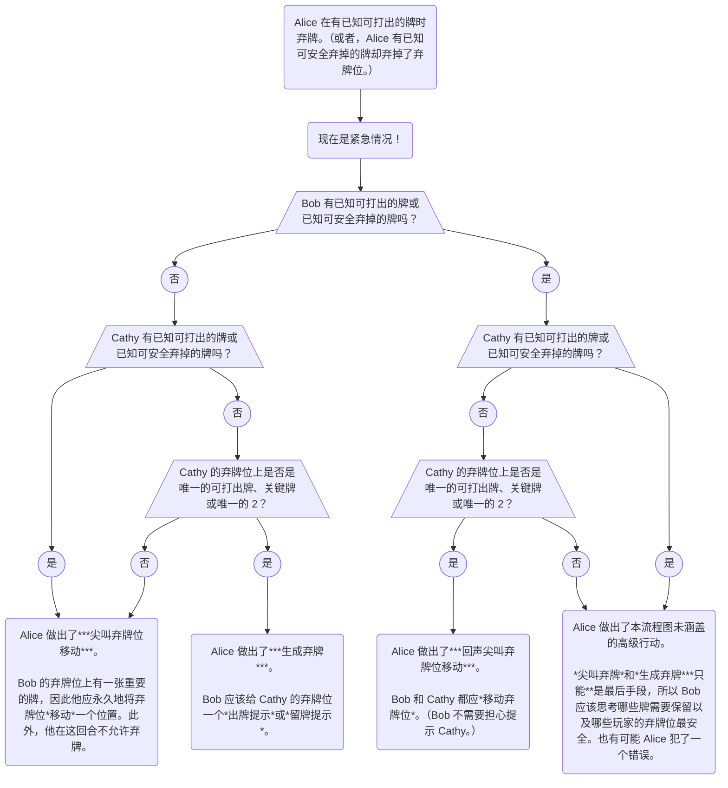

## 特殊行动 \{#special-moves\}

### 尖叫弃牌位移动（SDCM） \{#the-scream-discard-chop-move-sdcm\}

- *弃牌位移动*能够只用一个提示留住好几张牌。但是，有可能你一个提示机会都没有。解决这种情况的一个手段是做一种特殊的弃牌。
- 一般来说，弃牌是一种最后手段。因此，如果你手中有已知可以打出的牌，你反而弃牌，就可以向队友传递一个强烈的信号。这称为*尖叫弃牌（Scream Discard）*。由于队友原本期望你会打牌，所以这样做就像是在向他们尖叫，会让他们知道情况非常糟糕。
- *尖叫弃牌*会做两件事：
  1. “尖叫”的目标玩家应永久地将弃牌位*移动*一个位置。
  1. “尖叫”的目标玩家在这一回合不允许弃牌。相反，该玩家必须给出一个提示。如果无法给出正常的*出牌提示*或*留牌提示*，那么可以给出“停顿”提示，比如 _5 停顿_。如果无法给出 _5 停顿_，甚至可以只“填补”一些已经提示过的牌的信息（这样做不会引发*飞牌*）。
- 玩家<Em>**只能**</Em>为<Em>**可打出的牌或关键牌**</Em>（或其他地方未看到的仍有用的 2）_尖叫弃牌_。（参照*留牌原则*）
- 玩家<Em>**只能**</Em>将*尖叫弃牌*作为<Em>**绝对的最后手段**</Em>。这说明*尖叫弃牌*几乎只在**提示机会数为 0** 时做出。（较少见的情况下，也可以在只有 1 个提示机会且下家*锁手*时做出。）
- 玩家**不允许**为*差一张可打出*的牌*尖叫弃牌*。
- 但凡存在其他不太危险的方式来留牌，玩家就**不允许**{}_尖叫弃牌_。这是一种“万不得已”的行动。
- 有的时候玩家会在手中有已知可打出的牌时弃牌，但**并不**打算*尖叫弃牌*——是其他的特殊情况：
  1. 如果下一玩家**必须**生成一个提示机会来提示再下一玩家，那么不是*尖叫弃牌*。这被称为*生成弃牌*；见下。
  1. 如果玩家未打出的牌是被*飞*的“盲打”牌**并且**这张盲打牌也可能在下一玩家的*飞牌位*时，这不是*尖叫弃牌*。
- 译注：SDCM 的英文为 Scream Discard Chop Move，逐字翻译为“尖叫弃牌弃牌位移动”，为了顺口一点，我们去掉重复的“弃牌”字样。下面的[_喊叫弃牌_](#the-shout-discard-chop-move)等类似。

### 尖叫弃牌位移动（有已知废牌） \{#the-scream-discard-chop-move-with-known-trash\}

- 首先，请参阅[_尖叫弃牌_](#the-scream-discard-chop-move-sdcm)章节。
- 有时，玩家手中会有一张或多张已知的废牌。此时玩家应首先弃掉已知的废牌，再从弃牌位弃牌。
- 如果玩家弃掉了弃牌位而不是已知的废牌，这一定是在传递某种信号。就像有可打出牌时仍然弃掉弃牌位一样，这应该触发*尖叫弃牌*。
- 尽管这个行动与普通的*尖叫弃牌*触发方式有所区别，但由于很类似，我们仍然称之为*尖叫弃牌*。
- 如果玩家手中既有已知可打出的牌和已知的废牌，那么弃掉弃牌位是违规的。如果有玩家这样做了，应被视为已知错误。

### 喊叫弃牌位移动 \{#the-shout-discard-chop-move\}

- 首先，请参阅[_尖叫弃牌_](#the-scream-discard-chop-move-sdcm)章节。
- 正常来说，当玩家*尖叫弃牌*时，会弃掉弃牌位（一张可能未知且未提示过的牌）。
- 然而，如果玩家既有已知可打出的牌又有已知的废牌，那么弃掉废牌而不是打出可打出的牌仍然可以达到与*尖叫弃牌*同样的效果。这称为*喊叫弃牌（Shout Discard）*，以区别于更寻常的情况。
- 换句话说：
  - *尖叫弃牌*是当你有已知可打出的牌时，弃掉一张未知牌来传递紧急信号。
  - *喊叫弃牌*是当你有已知可打出的牌时，弃掉已知的废牌来传递紧急信号。
- *喊叫弃牌*像*尖叫弃牌*一样，将下一玩家的弃牌位*移动*一位。
- *喊叫弃牌*像*尖叫弃牌*一样，强制下一玩家下回合**不允许**弃牌。
- *尖叫弃牌*正常只能用于将弃牌位*移*过关键牌或可打出的牌。然而，与*尖叫弃牌*不同，*喊叫弃牌*可以用于将弃牌位*移*过任何有用的牌，即使它并非关键或可打出。
- *尖叫弃牌*正常只能在提示机会为 0 时执行（或不可能提示要留的牌时）。然而，与*尖叫弃牌*相反，*喊叫弃牌*可以在有任意数量提示机会时执行。

### 生成弃牌 \{#the-generation-discard\}

- 通常，如果有人弃牌而不是打出已知可打出的牌，会表示*尖叫弃牌位移动*。
- 然而如果打出这张牌（玩家 1）会导致下一玩家弃牌（玩家 2），而再下一玩家（玩家 3）的弃牌位上有一张未提示的关键/可打出牌，情况将非常糟糕。因此，这次弃牌**仅仅**是为了生成一个提示机会，以便玩家 2 可以提示玩家 3。
- _生成弃牌_<Em>**只允许**</Em>作为最后的手段使用。如果玩家 3 有其他事情可做（比如出牌或给出明显的提示），那么玩家 1 应该直接出牌，并暂时先不玩家 3 的弃牌位。

## 一般原则 \{#general-principles\}

### 尖叫弃牌流程图 \{#a-scream-discard-flowchart\}

以下是一张用于判断某次弃牌是*尖叫弃牌位移动*还是*生成弃牌*的流程图。

### 路线 \{#lines\}

- 在你的回合，找出最佳行动涉及到展望未来，看看下家会做什么。如果对方弃牌，会有问题吗？对方会给出一些明显的提示吗？等等。
- 随着你在花火中进步，你不仅需要为下家，还需要为整桌玩家做一轮预测。你真正擅长花火时，会需要尽可能远地作出预测。（有时会预测未来 15 步或更多。）
- 类似于国际象棋，开始一个你可以预测接下来一系列行动的行动被称为开始一条“路线（Line）”。
- 在复盘中，我们经常会对比并假设性地尝试两条不同的路线，看看哪一条更好。

### 全 4 测试 \{#the-all-4s-test\}

- 根据*留牌原则*，必须避免让任何关键牌和可打出牌弃掉。所以构建路线一部分在于判断这种情况是否会发生。
- 考虑一条路线时，不能安全地假设某名玩家会提示你手中的任何牌。你应该进行*全 4 测试*：如果我手中全部是无用的 4，每个人会做什么？如果关键牌或可打出牌会被弃掉，那么这条路线就未能通过测试，它大概不太好。

### 悬张的概念 \{#the-definition-of-riding\}

- 首先，请参阅[设计路线](#lines)的章节。
- 平时，当有玩家的弃牌位上有重要的牌时，其他玩家会确保在这张牌有机会被弃掉之前提示到这张牌。
- 然而，在罕见情况下，提示机会可能非常少，无法合理地提示某玩家弃牌位上重要的牌。这时只能寄希望于这名玩家在自己的回合选择给出提示而不是弃牌。
- 这里，我们会说这张重要的牌“悬在弃牌位上（riding on chop）”，或者简称这样的牌为“悬张”。
  - 译注：原文使用“riding on chop”，比喻表示某物已经危险地骑在砧板边缘，随时可能被剁（Chop）掉。
- 每当有重要的牌悬在弃牌位上时，游戏都有可能输掉。因此，只有在万不得已的时候，你才可以设计一条导致牌悬在弃牌位上的路线。即使你认为有那张重要牌的玩家会一定给出一个“显然”的提示，也要记得你看不到自己手中的牌（以及轮到该玩家之前抽到的新牌），而这些牌可能会影响对方的行动。
- [_生成弃牌_](#the-generation-discard)是一个基础范例，避免有牌悬在弃牌位上的路线。

### 盲打已被弃牌位移过的牌 \{#blind-playing-chop-moved-cards\}

- *弃牌位移动*常常在游戏初期发生。之后，为打出被弃牌位*移*过的牌，它们会被直接提示。
- 但是某些其他情况下，被弃牌位*移*过的牌会一直留着，永远不会被提示。游戏接近尾声时，持有被弃牌位*移*过的牌的玩家会逐渐累积关于它的信息。例如，这张牌可能累计被许多提示否定。或者，可能可以推断出它可能不是任何已经打出过的牌（在游戏接近尾声时会大大减少可能性）。
- 聪明的玩家在被弃牌位*移*过的牌上积累了足够的信息后，有可能判断这张牌的所有可能性都可打出。这种情况下，他们不必等待队友直接提示这张牌——他们可以简单地盲打，无论具体是哪张牌，都会成功。
- 像这样盲打很危险！玩家放弃提示已被弃牌位*移*过的牌而选用其他人手中另一张相同的牌相当常见。（例如，有可能另一张牌能适用 1 换 2 的提示而非 1 换 1 的提示，更加高效。）因此，盲打已被弃牌位*移*过的牌总是有可能累计一个失误（相同的牌可能已经主动用过，也可能*弃牌位移动*原本就是个误会）。
- 出于这样的原因，聪明的玩家应该在已被弃牌位*移*过的牌可打出概率很大时尝试盲打，但<Em>**仅在还可以接受一次以上的失误时**</Em>。
- 由此，玩家<Em>**不**</Em>应该提示被弃牌位*移*过的现在已经无用的牌来防止将来的失误。典型的办法是在游戏剩余时间里，就让它保持被弃牌位*移*过的状态：
  - 最好的情况下，弃牌位被*移动*过的玩家会自然推断出这张牌是废牌，可以安全弃掉。或者，他们会保持这张牌被弃牌位*移*过的状态，继续从弃牌位弃掉其他无用的牌，直到游戏结束。
  - 最坏的情况下，弃牌位被*移动*过的玩家会盲打这张牌，造成一个失误。但这并不是必然，且即使发生，他们也只在还可以接受失误时这么做。
